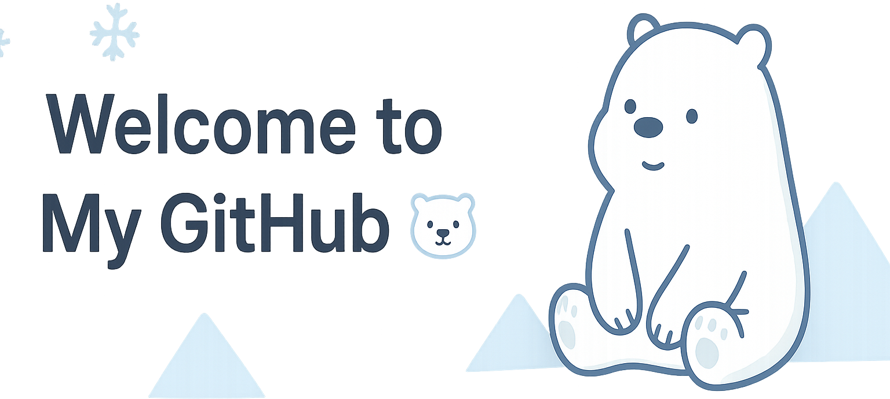

# 🐻‍❄️ **Ysh**

---

## ❄️ ABOUT ME

Hello, I’m Yshian.  
I like quiet code, minimal designs, and solving problems with a calm approach.  
Most of my projects reflect simplicity, focus, and curiosity.

---

## 🧊 AREAS OF INTEREST & PROGRAMMING LANGUAGES

**Areas:**  
`Web Dev` • `Minimalist UI` • `Open Source`

**Languages & Tools:**  

---

## 🏔️ PROJECTS

---

## 🌨️ FUN FACTS

- I drink more tea than Ice Bear drinks fish smoothies.
- I’d rather walk in cold weather than in the heat.
- I believe dark mode saves more than just battery.
- I can write “Hello, World!” in three languages… with mittens on.
- I believe every bug can be fixed with a calm mind (and maybe a nap).

---

## 📫 CONTACTS

---

## 🧊 FOOTER

_Last updated: 08/29/25_

**Thanks for visiting! 🐻‍❄️**

